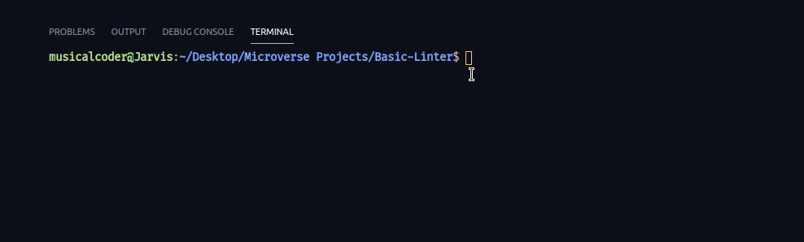
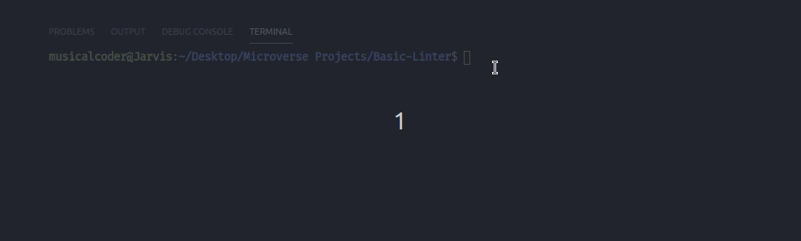

# Basic CSS Linter

> This repo contains the code to my own version of a code linter. This linter lints CSS files.

The main objective of this project was to build a simple linter that could parse through code and give you an an output of the error and where it occurred. This basic CSS Linter accepts the pathe to a `CSS` file and it opens the file and reads its contents line by line searching the entire file passes on three criterions:
1. That it contains spaces before certain symbols such as: '{' and '('.
2. That it contains spaces after symbols such as: ')', ':' and ','.
3. That a newline exists after the following symbols: '{', '}' and ';'.

The following are upcoming features to the project:
1. Lint HTML through a URI.
2. Give more precise errors like on what line it occurred

## Built With

- Ruby

## Live Demo
[Live Demo Link](https://repl.it/@KelynPaul/Basic-Linter)

## Getting Started
To get a local copy up and running follow these simple example steps.

### Prerequisites
- Git
- Ruby 

### Setup
To have the project up and running on your machine, follow the following:
- [ ] Clone the repo using `git clone https://github.com/KelynPNjeri/Basic-Linter.git`
- [ ] Open the cloned project.
Here is a small walk through:

### Usage
So far, this project searches the entire file and ensures it passes three criterions:
1. That it contains spaces before certain symbols such as: '{' and '('.
2. That it contains spaces after symbols such as: ')', ':' and ','.
3. That a newline exists after the following symbols: '{', '}' and ';'.

To lint your code snippet:
1. Run `main.rb` using `ruby bin/main.rb [path_to_file]`.
2. In a few seconds, you will get a series of errors if your file has errors or you will get no response meaning there's nothing wrong with your file.

### Run tests
To run the tests:
- From the project `root directory` run `rspec`
Here is a walkthrough on how to do it:

## Author

👤 **Kelyn Paul Njeri**

- Github: [@KelynPNjeri](https://github.com/KelynPNjeri)
- Twitter: [@KelynNjeri](https://twitter.com/kelyn-njeri)
- Linkedin: [Kelyn Paul](https://linkedin.com/kelyn-paul)

## 🤝 Contributing

Contributions, issues and feature requests are welcome!

Feel free to check the [issues page](issues/).

## Show your support

Give a ⭐️ if you like this project!

## Acknowledgments

- Hat tip to anyone whose code was used
- Inspiration
- etc

## 📝 License

This project is [MIT](lic.url) licensed.
